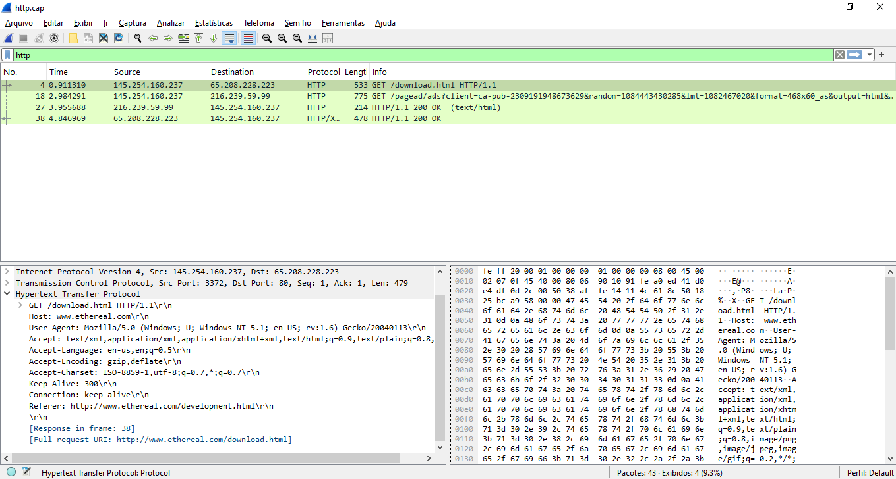
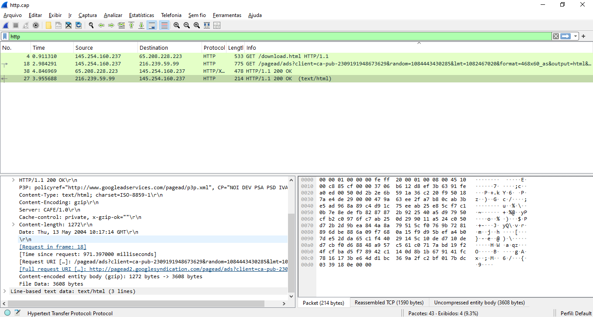
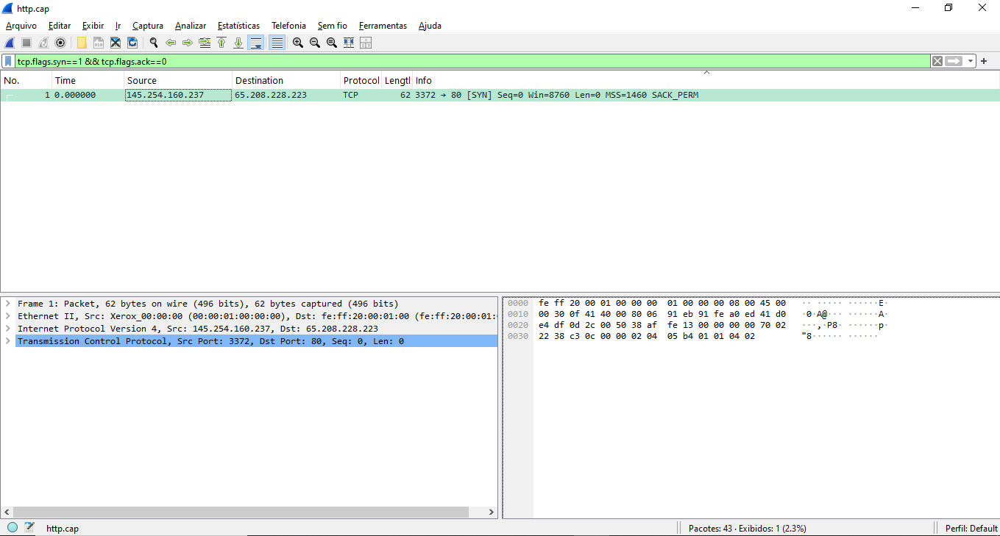

# Wireshark Lab — HTTP Traffic Analysis

## Objective
Analyze a real HTTP packet capture to identify cleartext data 
exposure, communication patterns and security risks from a 
SOC analyst perspective.

## Environment
- Tool: Wireshark
- File: http.cap
- Source: wiki.wireshark.org/SampleCaptures

## Filters Applied

| Filter | Purpose |
|--------|---------|
| http | Isolate HTTP traffic only |
| tcp.port == 80 | Confirm unencrypted port 80 usage |
| tcp.flags.syn==1 && tcp.flags.ack==0 | Detect SYN scan pattern |

## Findings

### Network Identification
- Client IP: 145.254.160.237
- Server IP: 65.208.228.223
- Protocol: HTTP — Port 80 — UNENCRYPTED

### HTTP Request Analysis
- Method: GET /download.html HTTP/1.1
- Host: www.ethereal.com
- User-Agent: Mozilla/5.0 (Windows NT 5.1; rv:1.6) Gecko/20040113
- Referer: http://www.ethereal.com/development.html
- Accept-Encoding: gzip, deflate
- Connection: keep-alive

### HTTP Response Analysis
- Status: HTTP/1.1 200 OK
- Server: CAFE/1.0
- Content-Type: text/html; charset=ISO-8859-1
- Content-Encoding: gzip
- Cache-Control: private

### Security Risk — Cleartext Header Exposure
HTTP transmits all headers in plaintext. The full request is 
visible to any observer on the network including:
- User-Agent revealing OS and browser version (Windows NT 5.1, 
  Gecko/20040113) — useful for attacker fingerprinting
- Referer header revealing internal navigation path
- Accept-Charset and Accept-Language revealing system locale
- All communication readable without any decryption

In a SOC context this would trigger a policy violation alert. 
Any service transmitting data over HTTP must be flagged for 
remediation — HTTPS should be enforced at the firewall level.

### OSI Model — Protocol Layers Observed
- Layer 2 — Ethernet (Frame, MAC addresses)
- Layer 3 — Internet Protocol v4 (IP addressing)
- Layer 4 — Transmission Control Protocol (TCP, Port 80)
- Layer 7 — Hypertext Transfer Protocol (HTTP headers/body)

### SYN Packet Analysis
Filter applied: tcp.flags.syn==1 && tcp.flags.ack==0

Result: 1 SYN packet identified
- Source: 145.254.160.237 → Destination: 65.208.228.223:80
- This represents a legitimate TCP handshake initiation

In a port scan scenario, this filter would reveal hundreds of 
SYN packets sent to different ports in rapid succession with 
no SYN-ACK response — a clear indicator of network 
reconnaissance activity.

## Conclusion
This lab demonstrates core Wireshark skills applied to SOC 
analysis. Key findings:

1. HTTP exposes full request headers in cleartext — 
   attacker on the same network can read OS, browser, 
   navigation path and all request metadata
2. SYN filter successfully isolates connection initiation 
   packets — essential technique for detecting port scans
3. OSI layer identification confirmed — each protocol 
   operates at its expected layer within the packet structure

Recommendation: enforce HTTPS across all services. 
Block HTTP or redirect to HTTPS at the firewall level. 
Monitor for anomalous SYN patterns as early indicator 
of network reconnaissance.

## Screenshots

